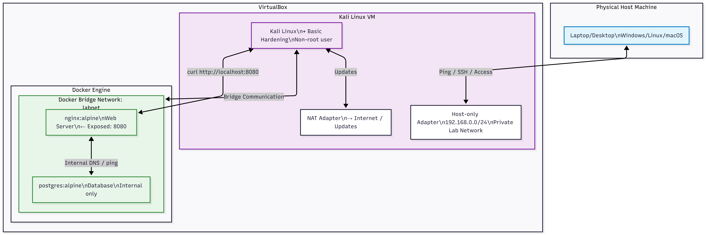
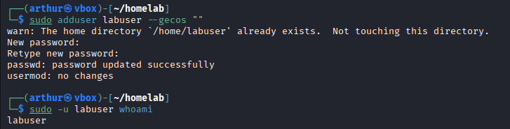
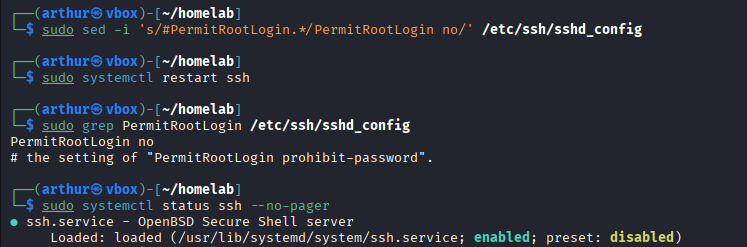
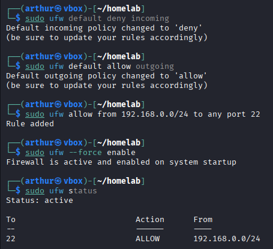

# Kali + Docker Home Lab

Um simples, reproduzível home lab demonstrando **setup de máquinas virtuais**, **comunicação de redes** entre uma Kali Linux VM e Docker Containers, e **hardening básico de sistemas**.

**Propósito**: mostrar habilidades práticas em virtualização, conteinerização, comunicação de redes e boas práticas de segurança - ideal para cargos de cibersegurança, DevSecOps e infraestrutura de TI.



## Objetivos.
- Instalar uma VM Kali usando VirtualBox.
- Configurar comunicação com múltiplos adaptadores (NAT + Host) para habilitar comunicação controlada.
- Implementar serviços usando Docker e Docker Compose.
- Demonstrar comunicação entre máquinas e contêineres.
- Aplicar e verificar hardening básico nas máquinas e contêineres.

## Habilidades Demonstradas.
- Virtualização com VirtualBox.
- Administração de sistemas com Linux (Kali).
- Docker e Docker Compose para orquestração de containers.
- Configuração de redes e troubleshooting.
- Gerenciamento básico de firewall (UFW)
- Boas práticas de configuração de segurança (uso sem root, hardening de SSH, updates).
- Documentação e setups reproduziveis.

## Arquitetura.
- **Host**: Windows 11
- **Kali VM**:
  - Adaptador 1: NAT (acesso à internet para atualizações)
  - Adaptador 2: Host-only Adapter (comunicação privada entre Host e outras VMs).
- **Containers** (rodando dentro da Kali VM):
  - `nginx:alpine`: web server (exposto no port 8080).
  - `postgres:alpine`: database (rede interna apenas).
- **Redes**:
  - Rede VirtualBox Host-only (VM ↔ Host)
  - Docker bridge network (`labnet`) (containers ↔ Kali VM)

## Pré-Requisitos.
- VirtualBox.
- Pelo menos 8GB de RAM e 50GB no HD/SSD do host.
- Familiaridade básica com o terminal do Linux.

## Setup

### 1. Setup da Kali VM
1. Baixe a Kali Linux do site oficial: [kali.org](https://www.kali.org/get-kali/).
2. Configure dois adaptadores de rede:
   - Adaptador 1 → NAT.
   - Adaptador 2 → Adaptador Host-only (crie se necessario).
3. Inicie o sistema, crie o usuário e atualize digitando: sudo apt update && sudo apt full-upgrade -y no terminal.

### 2. Instalação do Docker e serviços.
1. Instale o Docker dentro da Kali VM:

```bash
sudo apt install -y docker.io docker-compose
sudo systemctl enable --now docker
sudo usermod -aG docker $USER  # Log out e in depois desse passo.
```
2. Crie o diretório e o docker-compose.yml (arquivo completo no repositorio).
3. Inicie os serviços:
   ```bash
   mkdir ~/homelab && cd ~/homelab
   docker-compose up -d
   ```

### 3. Hardening Basico.

1. Criação de um usuário sem root com privilégios sudo:
    
    
    
3. Login SSH com root desativado:
    
    

4. Configuração da firewall UFW (bloquear tráfego externo por padrão, permitir só vindo de fontes confiaveis):
    
    

6. Updates e cleanup:

    ```bash
    sudo apt update && sudo apt full-upgrade -y && sudo apt autoremove -y
    docker-compose down
    ```
    
 Comandos de verificação usados:

 ```bash
 sudo ufw status
 ss -tuln
 docker ps
 docker network inspect labnet
```

 ### 4. Verificação e Testes

1. **Comunicação entre VM e Host**: Ping entre o Host e Kali através da rede Host-only.
2. **Entre Kali e Containers**: curl http://localhost:8080 e entre containers usando o nome dos serviços.
3. **Isolamento de contêineres**: Database não exposta.

### 5. Aprendizados

1. Segmentação eficaz de redes é essencial para labs seguros.
2. Docker simplifica a criação de serviços isolados com rede integrada.
3. Hardening não precisa ser complexo - configurações básicas (firewall, least privilege, updates) já melhoram a postura de segurança.
4. Documentação e reproducibilidade delineiam os projetos, melhoram a colaboração da equipe.

### 6. Tecnologias Usadas.

1. **Virtualização**: VirtualBox.
2. **OS**: Kali Linux.
3. **Containers**: Docker + Docker Compose.
4. **Networking**: NAT, Host-only, Docker bridge.
5. **Ferramentas**: UFW, SSH config, apt.


**Esse é um ambiente lab controlado**. Todas as configurações seguem as boas práticas de segurança para um homelab e não contêm vulnerabilidades intencionais.

 

